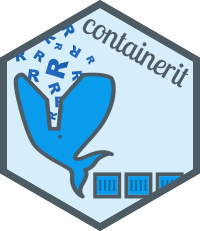

<!-- README.md is generated from README.Rmd. Please edit that file -->

# containerit

`containerit` packages R script/session/workspace and all dependencies
as a [Docker](http://docker.com/) container by automagically generating
a suitable `Dockerfile`. The packages’s website at
<https://o2r.info/containerit/>. A good summary of what the package does
can be found in this [o2r project blog
post](http://o2r.info/2017/05/30/containerit-package/).

[](http://www.repostatus.org/#wip)
[](https://travis-ci.org/o2r-project/containerit)
[](http://www.r-pkg.org/pkg/containerit)



## Quick start

### Install

Development version from GitHub.

    remotes::install_github("o2r-project/containerit")

### Use

See the vignettes at `vignettes/containerit.Rmd` for usage from the R
command line, and `vignettes/container.Rmd` for the usage from a regular
command line interface based on [containers from Docker
Hub](https://hub.docker.com/r/o2rproject/containerit/).

### Containers

Images are available starting from different base images. All images are
also available with version tags.

#### verse

Base image:
`rocker/verse:3.5.0`

[](https://microbadger.com/images/o2rproject/containerit "Get your own version badge on microbadger.com")
[](https://microbadger.com/images/o2rproject/containerit "Get your own image badge on microbadger.com")
[](https://microbadger.com/images/o2rproject/containerit "Get your own commit badge on microbadger.com")

#### geospatial

Base image:
`rocker/geospatial:3.5.0`

[](https://microbadger.com/images/o2rproject/containerit:geospatial "Get your own version badge on microbadger.com")
[](https://microbadger.com/images/o2rproject/containerit:geospatial "Get your own image badge on microbadger.com")
[](https://microbadger.com/images/o2rproject/containerit:geospatial "Get your own commit badge on microbadger.com")

## Contribute

All help is welcome: asking questions, providing documentation, testing,
or even programming.

Please note that this project is released with a [Contributor Code of
Conduct](CONDUCT.md). By participating in this project you agree to
abide by its terms.

## Development

[r-hub builder](https://builder.r-hub.io/) is great for running checks,
e.g. before submitting to CRAN and on other operating systems.

``` r
library(rhub)
rhub::check_for_cran()
rhub::check_on_windows()
```

You can build the [`pkgdown`](http://pkgdown.r-lib.org/) site with

``` r
pkgdown::build_site()
```

You can build the Docker images locally with the current development
version using the following commands.

``` bash
docker build --tag containerit:dev --file inst/docker/Dockerfile.local .
docker build --tag containerit:geospatial-dev --file inst/docker/geospatial/Dockerfile.local .
```

## License

containerit is licensed under GNU General Public License, version 3, see
file LICENSE.

Copyright (C) 2018 - o2r project.
